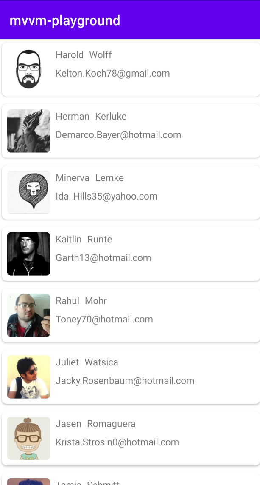
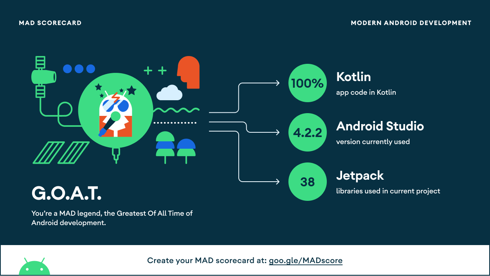

# Modern-Android-Development---MAD-Playground
This is a starter project showing the best approach for modern android development with clean architecture and jetpack components. The application simply loads a list of data from the network saves it in an offline database and displays to the user as a paginated list of items.

#### List of jetpack components used in the project
- [ViewModel](https://developer.android.com/topic/libraries/architecture/viewmodel)
- [Fragment](https://developer.android.com/jetpack/androidx/releases/fragment)
- [Navigation](https://developer.android.com/guide/navigation)
- [Livedata](https://developer.android.com/topic/libraries/architecture/livedata)
- [Room](https://developer.android.com/jetpack/androidx/releases/room)
- [Paging3](https://developer.android.com/jetpack/androidx/releases/paging#3.0.0)
- [Hilt](https://developer.android.com/training/dependency-injection/hilt-jetpack)

#### List of third party libraries used
- [Retrofit](https://square.github.io/retrofit/)
- [Glide](https://github.com/bumptech/glide)
